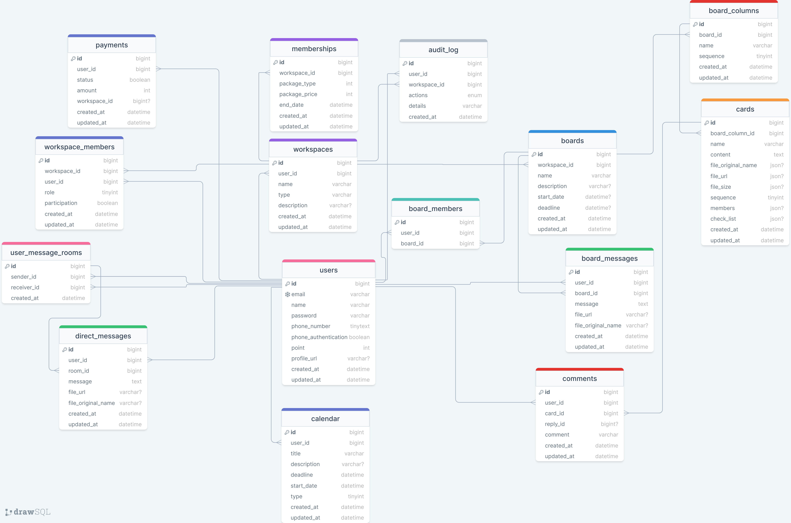
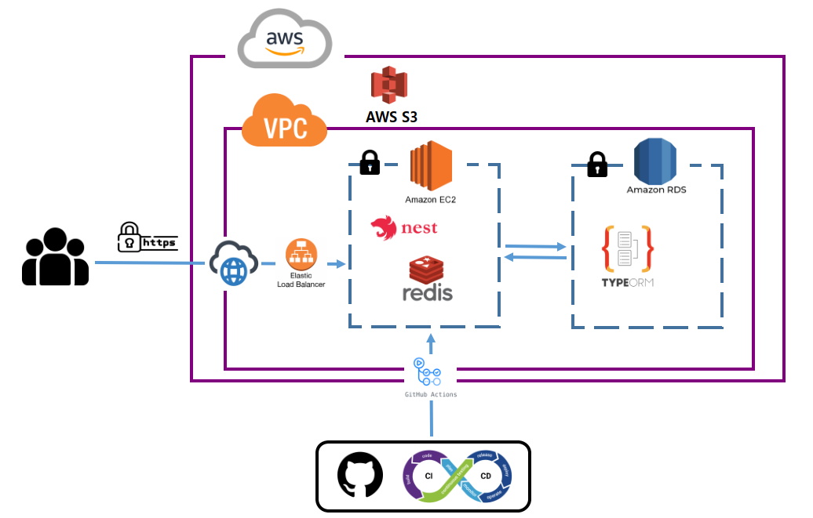
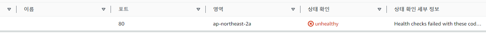

## 프로젝트 소개

### Work-Flow


Work Flow는 사람들과의 협업을 위한 서비스 입니다.
자신의 작업 공간에 팀원들 초대해서 함께 작업하고 서로 의견을 나눠보세요.

### [시연영상](https://youtu.be/15mqNHn4vmM)

### [Work-Flow 바로가기](https://work-flow.online)

### [사용 가이드](https://feather-almanac-87a.notion.site/Work-Flow-254abb21a36d40bbaf70fb6f065c21d3)

## ERD



## 서비스 아키텍처



## 기술적 의사결정

| 사용기술         | 도입 이유                                                                                                                                                                                                                                                                                                    |
| ---------------- | ------------------------------------------------------------------------------------------------------------------------------------------------------------------------------------------------------------------------------------------------------------------------------------------------------------ |
| NestJS           | Express가 성능도 좋고 사용하기 쉽지만 NestJs를 사용한 이유는 아키텍처에 관한 정의나 기능을 제공해주고<br> 프로젝트 코드를 TypeScript 기반으로 작성했기 때문에 호환성이 좋은 NestJs를 사용                                                                                                                    |
| Redis            | 현재 인증 및 인가 방식으로 헤더에 accessToken을 통한 검증 로직을 채택해 사용 중인데, 이 경우 토큰을 쿠키에 저장하게 되어 보안 상 위협이 커짐.<br> 이를 해결하기 위해 만료시간을 줄이고 만료 시간이 남은 토큰이더라도 로그아웃이 되었다면 해당 토큰은 탈취된 토큰으로 간주해 배제함으로 보안 향상을 위해 사용 |
| Git Action CI/CD | 개발환경에 필수적인 요소로 자동화된 파이프라인을 통해 코드 변경을 원활하게 진행할 수 있고, 지속적으로 통합 및 배포를 하기 위해 사용                                                                                                                                                                          |
| Socket.io        | 실시간 양방향 통신을 사용하여 실시간 채팅 및 알림 메시지등을 전송하기 위하여 사용                                                                                                                                                                                                                            |
| TypeORM          | 워크스페이스를 생성하게 되면 유저는 도메인(생성자), 매니저, 외부인 등으로 각각 다양하게 연계가 돼있어 효율적인 서버 관리를 위해 관계형 데이터베이스를 선택                                                                                                                                                   |
| Web RTC          | 웹기반 영상 통화 및 화면 공유 등의 실시간 통신을 구현하기 위하여 사용                                                                                                                                                                                                                                        |
| Multer, S3       | 파일 업로드 및 다운로드를 처리하여 사용자가 파일을 업로드, 다운로드 할 수 있게 하기 위하여 사용                                                                                                                                                                                                              |

## 주요 기능

1. 참여한 보드 단체 채팅 및 1:1채팅
2. 영상통화 및 화면공유
3. 채팅 및 초대 등의 실시간 알림
4. 파일 업로드 및 다운로드, 워크스페이스를 통한 전체파일 관리
5. 담당자 별 또는 소규모 팀에 따른 보드와 카드를 만들어 업무 분담 및 관리
6. 멤버십기능을 도입하여 무료버전과 프리미엄버전 구분

## 트러블 슈팅

<details><summary>EC2 프리티어 RAM이슈
</summary>

**발생문제**: NestJs가 빌드 과정이 있다보니 t2.micro의 기본제공 용량으로는 빌드 진행 과정에서 멈추는 문제가 발생, Heap out of Memory에러 발생

**해결방법**

1. 빌드 과정이 멈추는 문제는 디스크의 일부를 대신 사용하도록 설정하여 해결 (메모리 스왑)

```bash
$sudo dd if=/dev/zero of=/mnt/swapfile bs=1M count=2048

$sudo mkswap /mnt/swapfile

$udo swapon /mnt/swapfile

$sudo chmod 600 /swapfile
```

리눅스 권장 스왑 용량으로 시스템의 RAM 용량이 4GB 이하라면 최소 2GB의 스왑 공간이 필요하므로 2GB 스왑메모리를 생성하고 스왑파일 스왑공간으로 설정한 뒤<br>
활성화 해주고 루트 사용자만 읽고 쓸 수 있도록 권한을 수정

.png>)

스왑메모리가 활성화 된 것을 확인한 뒤 다시 npm run build를 실행하면 빌드가 멈추지 않고 정상적으로 진행되는 것을 확인할 수 있음

2. Git Action으로 CD를 진행하던 중 Heap out of Memory 에러 발생

.png>)

build하는 과정 중에 node.js에서 사용할 수 있는 기본 메모리양을 넘어서 에러가 발생

```bash
$export NODE_OPTION=--max-old-space-size=2048
```

스왑 메모리와 동일하게 2GB까지 사용할 수 있도록 메모리를 늘려준 뒤 CD를 실행시켜보니 정상작동 확인
-> 현재는 메모리부족을 방지하기 위해 4GB로 설정하였음

.png>)

</details>

<details>
<summary>보드 조회 시 로딩 문제
</summary>

**발생문제**: 보드전체 조회 API를 요청 시 비동기 처리로 해당 정보를 가져오는데, 보드멤버의 프로필 정보도 필요하여<br>
보드멤버의 정보를 가져오는 비동기 함수를 중첩시키니 페이지 로딩이 3초 이상 걸리는 문제가 발생하였음

```javascript
// 보드 전체 조회
async function getMyBoards() {
  try {
    await $.ajax({
      method: 'GET',
      url: `/boards?workspaceId=${workspaceId}`,
      beforeSend: function (xhr) {
        xhr.setRequestHeader('Content-type', 'application/json');
        xhr.setRequestHeader('authorization', `Bearer ${accessToken}`);
      },
      success: async (data) => {
        const boards = data.boards;
        let result = '';
        let button = '';

        for (const board of boards) {
          result += `// HTML코드 생략 `;
          const data = await getBoardMembers(board.boardId);
          const boardMembers = data.boardMembers;
          for (const member of boardMembers) {
            let Img = '';
            member.profileUrl ? (Img = `${member.profileUrl}`) : (Img = `/assets/img/favicon.png`);
            result += `// HTML코드 생략`;
          }
        }
        button += `// HTML코드 생략 `;
        printBoard.innerHTML = result;
        printButton.innerHTML = button;
      },
    });
  } catch (err) {
    console.error(err);
  }
}
```

네트워크 탭을 확인해보니 데이터량이 많지 않았는데도 반복문을 돌면서 API를 요청하다 보니 로딩시간이 길어진 것으로 확인

**해결방법**: GET 요청을 할 때 백엔드에서 TypeORM의 relations를 사용하여 보드멤버의 정보와 userId가 일치하는 유저의 정보까지 가져올 수 있도록 코드를 리팩토링

**기존코드**

```typescript
// 보드 조회
  async GetBoards(workspaceId: number) {
    const workspace = await this.workspaceService.getWorkspaceDetail(workspaceId);
    const findBoards = await this.boardRepository.find({ relations: ['workspace', 'board_members'] });
    if (!workspace) throw new NotFoundException('해당 워크스페이스는 존재하지 않습니다.');

    const boards = findBoards.filter((board) => {
      return board.workspace.id == workspaceId;
    });
    return boards.map((board) => {
      return {
        workspaceId: board.workspace.id,
        boardId: board.id,
        boardName: board.name,
        description: board.description,
        boardMembers: board.board_members,
        createdAt: board.created_at,
        updatedAt: board.updated_at,
      };
    });
  }
```

**수정코드**

```typescript
const workspace = await this.workspaceService.getWorkspaceDetail(workspaceId);
const findBoards = await this.boardRepository.find({
  where: { workspace: { id: workspaceId } },
  relations: ['board_members.user'],
});
if (!workspace) throw new NotFoundException('해당 워크스페이스는 존재하지 않습니다.');

const boardInfo = findBoards.map((board) => {
  const boardMembers = board.board_members.map((boardMember) => ({
    id: boardMember.user.id,
    name: boardMember.user.name,
    email: boardMember.user.email,
    profile_url: boardMember.user.profile_url,
    phone_number: boardMember.user.phone_number,
  }));

  return {
    workspaceId,
    workspaceName: workspace.name,
    boardId: board.id,
    boardName: board.name,
    description: board.description,
    deadline: board.deadline,
    startDate: board.start_date,
    boardMembers: boardMembers,
    createdAt: board.created_at,
    updatedAt: board.updated_at,
  };
});
```

</details>

<details>
<summary> 502 BAD Gateway 이슈
</summary>

**발생문제**: CD를 진행하던 도중 오류가 발생한 이후 EC2 CPU 사용량이 100퍼센트를 달성하더니 서버가 멈춰버림.<br>
프리티어는 자정 쯤 EC2 서버가 엄청 느려지거나 멈추는 현상이 있다 하여 서버를 중지하고 재가동했는데 해당 문제가 발생

**해결방법**:

1. 대상그룹이 unhealth 상태라면 로드밸런서 문제일수도 있다하여 로드밸런서 및 대상그룹 재생성 후 레코드를 새로 생성해줌



\*현재는 규칙 설정에 https로 리디렉션을 걸어두어 302코드로 실패했다고 나오지만 초기에는 Health checks failed 상태였음
-> 로드밸런서 및 대상그룹을 재 생성하여도 해당 문제가 해결되지 않아 다음 스텝을 진행

2. 서버가 불안정하거나 메모리 이슈가 발생하여 멈춰버리면 통신이 불가능하여 해당 문제가 발생하는 경우가 있다고 하여 스왑메모리 설정과 노드 메모리 사용량을 다시 2GB로 세팅해주었음
   -> 빌드까진 정상적으로 진행되지만 여전히 해당 문제가 해결되지 않음

3. 다시 처음 서버를 세팅하는 것처럼 하나하나 생각을 해보다 HTTP 80번 요청을 3000번으로 변경해주는 과정이 빠져있던 것을 발견
   -> 인스턴스를 중지하고 실행하면 새로운 IP주소를 배정받고 모니터링 데이터가 초기화 되는 것으로 보아 초기 세팅 과정을 다시 해줘야 하는 것으로 예상됨

```bash
$sudo iptables -t nat -A PREROUTING -i eth0 -p tcp --dport 80 -j REDIRECT --to-port 3000
```

iptables 규칙 변경 명령어를 통해 80 → 3000으로 변경해주니 정상 작동

</details>

<details>
<summary> 그룹채팅 및 1:1채팅방
</summary>

**발생문제(1)**:

- 템플릿에 맞춰 프론트를 구현 했는데, 해당 프론트의 대화창에는 그룹 채팅 및 1:1 채팅방이 한 페이지에 전부 출력이 되도록 설정되어 있었고 모두 모달로 구분이 되어 있었음.<br>
- 해당 템플릿 양식에 맞춰 구현을 하기 위해선 보드의 멤버 정보(이름, 전화번호, 사진 등) / 해당 보드의 채팅 메시지 / 내 정보(내가 보냈는지 파악하기 위해) / 개인 메시지 방 정보 / 개인 메시지가 필요.<br>
- 부수적으로 채팅 방 제목을 통한 검색 & 유저 정보 & 검색을 통한 메시지 보내기 등의 기능이 필요.<br>
  **but)** 일반적인 API 호출을 통해 보여주기 위해서는 너무 많은 비동기가 필요해 로딩 시간이 4~5초가 걸려버리는 치명적 문제 발생

**해결방법**: 크게 두 가지로 묶어 API를 호출해 정보를 가져와 동적으로 채팅 방과 채팅 목록 그리고 대화 메시지를 생성하기로 함(그룹 채팅(보드)멤버 및 메시지 / 내 1:1 대화방 정보 및 메시지).<br>
또한 서버측에서는 쿼리빌더를 통해 해당 정보를 세 번의 쿼리문으로 가져오도록 구현

```typescript
//board-messages.controller.ts
@Get(':boardId')
  async GetBoardMessages(@Param('boardId') boardId: number, @GetUser() user: AccessPayload, @Res() res: Response) {
    const joinBoards = await this.boardsService.GetJoinBoards(user.id);

    joinBoards.sort((a, b) => {
      if (a.board_id / 1 === boardId) {
        return -1; // a가 boardId 일치하면 a를 앞으로 이동
      } else if (b.board_id / 1 === boardId) {
        return 1; // b가 boardId 일치하면 b를 앞으로 이동
      } else {
        return 0; // 나머지는 순서를 그대로 유지
      }
    });

    const boardMessageResults = await this.boardMessagesService.GetBoardMessages(joinBoards);
    const boardMembers = await this.boardsMemberService.FindBoardMembers(joinBoards);
    return res.status(HttpStatus.OK).json({
      boardMessageResults,
      boardMembers,
      userId: user.id,
      userName: user.name,
      userProfileUrl: user.profile_url,
    });
  }
```

```typescript
//내가 참여중인 보드 목록 가져오기
async GetJoinBoards(userId: number) {
  const joinBoards = await this.boardRepository
    .createQueryBuilder('board')
    .innerJoinAndSelect('board.board_members', 'member')
    .select(['board.id', 'board.name'])
    .where('member.user_id = :userId ', { userId })
    .getRawMany();
  return joinBoards;
}


//해당 보드 채팅방의 메시지 가져오기
async GetBoardMessages(joinBoards: any): Promise<any> {
  return Promise.all(
    joinBoards.map((board: any) => {
      return this.boardMessageRepository
        .createQueryBuilder('message')
        .innerJoinAndSelect('message.user', 'user')
        .innerJoinAndSelect('message.board', 'board')
        .select([
          'message.id',
          'message.board_id',
          'message.message',
          'message.file_url',
          'message.file_original_name',
          'message.created_at',
          'board.name',
          'user.id',
          'user.name',
          'user.profile_url',
          'user.phone_number',
          'user.email',
        ])
        .where('message.board_id = :boardId ', { boardId: board.board_id })
        .orderBy('message.created_at')
        .getRawMany();
	    })
	  );
	}

//참여중인 보드의 멤버 목록과 정보 가져오기
async FindBoardMembers(joinBoards: any) {
    return Promise.all(
      joinBoards.map(async (board: any) => {
        const boardMembers = await this.boardMemberRepository
          .createQueryBuilder('member')
          .innerJoinAndSelect('member.user', 'user')
          .innerJoinAndSelect('member.board', 'board')
          .select([
            'user.id',
            'user.name',
            'user.email',
            'user.phone_number',
            'user.profile_url',
            'board.id',
            'board.name',
          ])
          .where('member.board_id = :boardId ', { boardId: board.board_id })
          .getRawMany();

        return boardMembers;
      })
    );
  }
```

-> 위 방법과 유사하게 내가 참여중인 1:1 메시지 방 정보와 메시지 목록을 가져와서 뿌려주니 0.5~1.5초 사이로 줄어들게 됨(가져온 정보를 토대로 개인 정보 모달창 등 전부를 그려주는 시간이므로 상당히 단축)

**발생문제(2)**: 메시지 전송에 대한 알림 로직의 방향성을 정해야 했음, 통상적으로 생각했을 때

- 해당 채팅 방에 없고 다른 곳에 있어도 알림을 받아야 할 수 있고,
- 채팅방에 있는 경우 내가 메시지를 보냈다면 내 화면에도 추가가 되야 하며 DB에 저장이 되어야 하고,
- 해당 그룹 채팅 방 및 개인 메시지방에 접속 중인 유저도 최신화된 메시지와 채팅창이 보여야 하고,
- 내가 보냈는지 상대방이 보냈는지 구분이 되어야 하며,
- 파일을 보냈을 때에는 파일을 보냈다라고 표시가 되어야 함.

**해결방법**: 메시지를 보내면 우선 해당 메시지를 DB에 저장 후 그룹 방에 있는 모두에게 소켓을 통해 전달.<br>
이 때 내가 보낸 메시지일 경우에는 알림을 받지 말아야 하므로 localStorage에 임시적으로 분별이 가능한 값을 저장해 해당 값이 있다면 내가 보낸 것으로 간주 해 어떠한 action도 취하지 않음<br>
소켓으로 전달 받은 해당 그룹의 유저들은 해당 메시지를 로컬에 저장함<br>

**두 가지 용도**

- 메시지 창에 해당 보드의 가장 마지막 최신 메시지 보여주기
- 해당 채팅방에 있는 보드 멤버의 수만큼 반복해서 소켓 이벤트가 전달이 되기에 이미 메시지를 받고 해당 메시지에 대한 로직처리가 완료 되었다는 것을 구분하기 위함<br>

저장된 메시지는 네비게이션에 알림이 오도록 표현해주고 채팅방에 들어와 있는 유저 경우 채팅 내용을 화면에 최신화 시키고 채팅 목록에 있는 마지막 메시지도 최신화 시켜주는 것으로 구현

```typescript
//메시지 전송 버튼을 눌렀을 때 실행
function sendMessage(data) {
  const boardId = data.getAttribute('id');
  const boardName = data.getAttribute('boardName');

  sendRoomMessage(`room${boardId}`, boardName);
}

//메시지를 DB에 저장 후 소켓을 통해 전달
async function sendRoomMessage(roomId, boardName) {
  const inputMessage = document.getElementById(`${roomId}-messageInput`);
  const message = inputMessage.value;

  if (message.trim() !== '') {
    const boardId = roomId.replace('room', '');
    //메시지 저장
    const messageId = await saveMessage(boardId, message);

    if (messageId) {
      const date = new Date(Date.now());

      socket.emit('chatMessage', {
        messageId,
        message,
        room: roomId,
        boardName,
        date,
        profileUrl: loginProfileUrl,
        fileUpload: false,
        sendUserId: loginUserId,
      });
      inputMessage.value = '';
    }
  }
}

//게이트웨이에서 전달받은 데이터를 통해 채팅 목록을 최신화 & 채팅방 최신화
socket.on(
  'chatMessage',
  ({ userId, userName, messageId, message, room, boardName, date, profileUrl, fileUpload, sendUserId }) => {
    updateChatList(userName, message, room, boardName, date, profileUrl, fileUpload);
    appendMessage(userId, userName, messageId, message, room, date, boardName, profileUrl, fileUpload, sendUserId);
  }
);

//appendMessage
//파일 업로드인지 체크
if (fileUpload) {
  message = `<p>${userName} : 파일을 보냈습니다.</p>`;
  localStorage.setItem(`recentMessage-${room}`, message);
} else {
  //최근 메시지는 로컬스토리지에 저장
  message = `<p>${userName} : ${message}</p>`;
  localStorage.setItem(`recentMessage-${room}`, `${message}!@#${date}`);
}
localStorage.setItem(`recentProfileUrl-${room}`, profileUrl);

// 스크롤 아래로 이동
chatList.scrollTop = chatList.scrollHeight;
localStorage.removeItem('myMessage');

// 메시지를 보낸 주체가 나인지 구분
if (sendUserId === loginUserId) {
  localStorage.setItem('myMessage', true);
  localStorage.setItem(`recentTime-${room}`, date);
} else localStorage.setItem('myMessage', false);

socket.emit('newMessage', {
  message,
  room,
  boardName,
  date,
  profileUrl,
});

//header.js
//해당 메시지를 채팅방에 없는 사람들에게 전달
socket.on('newMessage', ({ message, room, boardName, date, profileUrl }) => {
  //내 메시지라면 return
  const myMessage = localStorage.getItem('myMessage');
  if (myMessage === 'true') return;

  //이미 받았던 메시지라면 return(채팅방에 있을 경우 위의 코드로 이미 적용이 되었기에)
  const result = existUpdateRecentMessage(message, room, date, profileUrl);
  if (result === false) return;

  //유저에게 알림
  announceMessage(message, room, boardName, date, profileUrl);
});
```

-> 개인 메시지도 비슷한 로직으로 구현했으나 개인 메시지 경우에는 메시지 알림 창에 보여주는 것보다 따로 보이지 않고 메시지 알림만 도착하도록 구현

</details>

<details><summary>화면 공유
</summary>

**발생문제**: WebRTC 구현 중 화면 공유를 구현하는데, 화면 공유가 되었는데, 내 화면에서만 화면 공유가 적용이 되었고 상대방에게는 보이지가 않는 문제점이 발생

**해결방법**:

1. offer와 candidate를 교환 했던 것 처럼 해당media의 MediaStream 정보를 받아 소켓으로 넘겨줘 localVideo.srcObject 값을 해당 스트림의 값으로 변경함으로 적용 시키려 했으나,<br>
   소켓을 통해 해당 MediaStream 정보가 넘어가지 않는 오류가 발생

2. 굳이 소켓을 통해 스트림 정보를 보내는게 아닌 내가 현재 원격으로 대화 중인 화면을 공유 화면으로 변경하는 것으로 로직을 구현

```typescript
// 화면 공유
async function screenShare() {
  try {
    if (screenShareBtn.innerText === '화면 공유') {
      screenShareBtn.innerText = '화면 공유 중';

      navigator.mediaDevices
        .getDisplayMedia({ video: { cursor: 'always' }, audio: { echoCancellation: true, noiseSuppression: true } })
        .then(async (stream) => {
          localVideo.srcObject = stream;
          const videoTrack = stream.getVideoTracks()[0];
          peerInfo[loginUserId].peerConnection
            .getSenders()
            .find((sender) => sender.track.kind === videoTrack.kind)
            .replaceTrack(videoTrack);
          videoTrack.onended = () => {
            const screenTrack = localStream.getVideoTracks()[0];
            peerInfo[loginUserId].peerConnection
              .getSenders()
              .find((sender) => sender.track.kind === screenTrack.kind)
              .replaceTrack(screenTrack);
            stream.getTracks().forEach((track) => track.stop());
            localVideo.srcObject = tempLocalStream;
          };
        });
    } else {
      screenShareBtn.innerText = '화면 공유';
      const screenTrack = localStream.getVideoTracks()[0];
      peerInfo[loginUserId].peerConnection
        .getSenders()
        .find((sender) => sender.track.kind === screenTrack.kind)
        .replaceTrack(screenTrack);
      localVideo.srcObject.getTracks().forEach((track) => track.stop());
      localVideo.srcObject = tempLocalStream;
    }
  } catch (err) {
    console.error(err);
  }
}
```

-> 화면 공유 버튼을 토글 느낌으로 변경하려 해서 해당 텍스트가 화면 공유 중이라면 화면 공유를 중지해야 하므로 미리 저장해 두었던 localVideo의 stream을 잠시 저장해 두고<br>
화면 공유가 끝나면 저장해둔 stream의 Track을 변경해 줌으로서 원래 내 화면으로 돌아오도록 함.

-> 화면 공유가 필요할 때에는 MediaStream을 만들어 내가 현재 연결된 peerConnection의 트랙을 생성된 스트림의 트랙으로 변경하니 상대 화면에서도 같이 변경이 되는 것을 확인,<br>
onended는 커스텀으로 만든 버튼이 아닌 화면 공유 시에 나오는 기본 중지 버튼을 눌렀을 경우에도 화면 공유가 종료가 될 수 있도록 하기 위해 설정 했음

</details>
